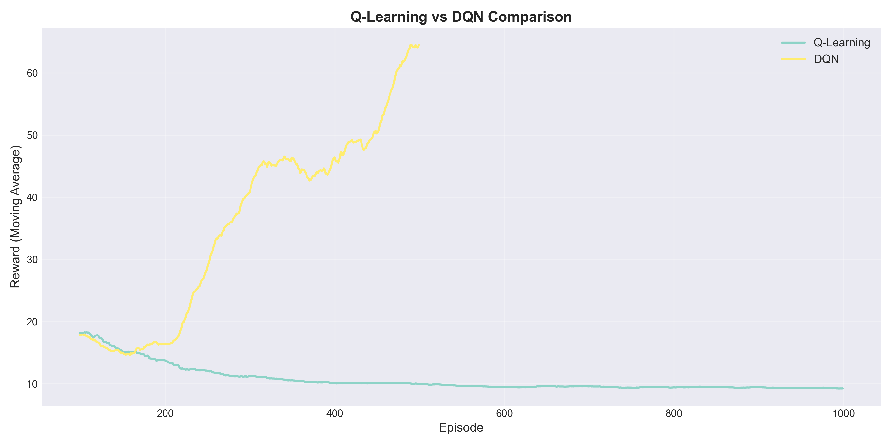
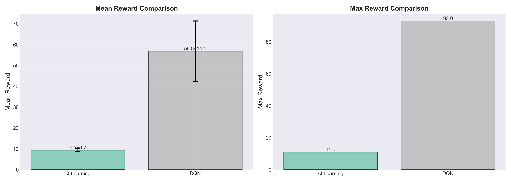
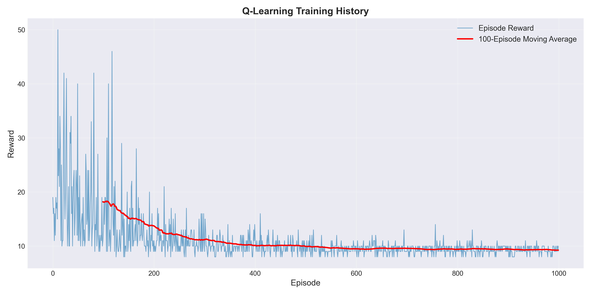
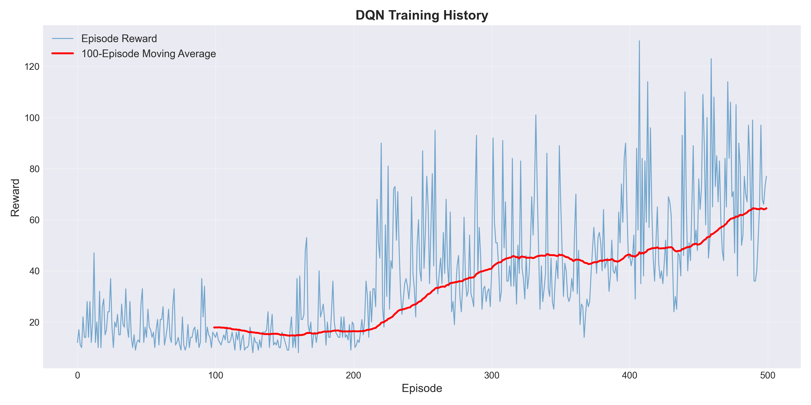

# 倒立振子シミュレーション（CartPole）

---

## 概要
本プロジェクトは、倒立振子（Cart-Pole）問題を強化学習により解くことを目的としたシミュレーションです。  
CartPole 環境では、棒（pole）をできるだけ垂直（倒れない状態）に保ち続けることが目標になります。学習が進むにつれて、振子が倒れる前に適切な力を加える行動を選べるようになります。

学習手法として **Q-Learning** と **DQN（Deep Q-Network）** の2種類を実装し、それぞれについて  
- **学習（トレーニング）**
- **評価（学習済み方策の性能確認）**
- **結果の可視化（学習推移・評価指標のグラフ化）**  
まで一通りの流れを整理して実行できるようにしました。

---

## 使用技術
- Python（実装の中心言語）
- NumPy（数値計算）
- 強化学習
  - Q-Learning（状態を離散化して Q テーブルを更新）
  - DQN（ニューラルネットワークを用いて Q 関数を近似）
- 可視化
  - Matplotlib 等を用いた学習履歴や評価結果のグラフ化
-（任意）TensorFlow / Keras（DQN の実装に使用）
  
※環境やライブラリは `requirements.txt` にまとめています。

---

## CI/CD（自動テスト）

本プロジェクトは GitHub Actions を用いて、以下を自動実行しています：

[](https://github.com/saki-nya1539/inverted-pendulum.git/actions)

- **ユニットテスト**（tests/ 以下）
- **コード品質チェック**（flake8, black）
- **複数 Python バージョンでの検証**（3.9, 3.10, 3.11）
- **依存関係の検証**

### ワークフロー
- **main / develop ブランチへの push、および Pull Request 時**に自動実行
- すべてのテストが通らない場合、マージがブロックされます

### 実行結果の確認
GitHub リポジトリの **Actions** タブから確認できます：

https://github.com/saki-nya1539/inverted-pendulum/actions

詳細は [.github/workflows/python-ci.yml](.github/workflows/python-ci.yml) を参照。

---

## 主な機能
### 1. CartPole 環境の実装・状態離散化
CartPole の状態（位置、速度、角度、角速度）を受け取り、**Q-Learning では扱いやすいように状態を離散化**します。  
離散化の方式により、学習の精度や収束速度が変わるため、環境側で状態処理を整理しました。

### 2. Q-Learning エージェント
Q-Learning では、Q値テーブルに対して反復更新を行い、行動方策を改善します。

- **ε-greedy による行動選択**
  - 確率 ε で探索（ランダム行動）
  - 確率 $1-ε$ で活用（最大Q値の行動）

- **Q値更新**
  次の式に基づいて Q 値を更新します：

  $$
  Q(s,a) \leftarrow Q(s,a) + \alpha \left(r + \gamma \max_{a'} Q(s',a') - Q(s,a)\right)
  $$

- **学習率・εの減衰**
  学習率（α）と探索率（ε）を調整し、学習後半で安定していくようにします。

### 3. DQN エージェント
DQN は Q-Learning の「Q値を表に持つ」部分を、ニューラルネットワークで近似する手法です。  
そのため、学習の安定性を確保するために以下を実装しています。

- **リプレイバッファ**
  過去の遷移 $(s,a,r,s')$ を保存し、学習時にランダムサンプリングすることで相関を弱めます。

- **ターゲットネットワーク**
  学習用ネットワークとは別にターゲットネットワークを用意し、更新タイミングを調整することで発散を抑えます。

- **ε-greedy による行動選択**
  学習初期は探索寄り、学習が進むにつれて活用寄りになるよう ε を減衰させます。

### 4. 学習・評価
- **トレーニング**
  エピソードごとの報酬（reward）とエピソード長（length）を記録します。

- **評価**
  学習済みモデルを用いて一定回数エピソードを実行し、平均報酬などの指標を出します。  
  評価では探索を弱める／オフにするなど、方策評価に適した設定にすることを想定しています。

### 5. 可視化
- **学習履歴**
  - 報酬推移（エピソードが進むにつれてどれだけ改善しているか）
- **エピソード長の分布**
  - どれくらい長く倒れずに維持できているかを分かりやすく確認
- **アルゴリズム比較（必要に応じて）**
  - Q-Learning と DQN の学習曲線や評価指標を比較し、どちらが安定しているかを確認

---

## スクリーンショット

### 学習推移グラフ


### 性能比較グラフ


---

## 実行結果

### 評価性能の比較

Q-Learning と DQN の学習済みモデルを評価した結果、**DQN が圧倒的に優れた性能を発揮しました**。

| 項目 | Q-Learning | DQN | 改善率 |
|------|-----------|-----|--------|
| **平均報酬** | 9.48 | **194.38** 🏆 | **+1950%** |
| **最大報酬** | 11.00 | **422.00** 🚀 | **+3736%** |
| **最小報酬** | 8.00 | 99.00 | +1138% |
| **標準偏差** | 0.78 | 55.24 | 性能の安定性向上 |

### 学習曲線の推移

#### Q-Learning


Q-Learning は初期段階から約 9.48 の報酬で停滞し、改善傾向が見られません。  
**原因**：状態離散化が粗すぎるため、より細かい制御ができていない可能性があります。

#### DQN


DQN は学習が進むにつれて報酬が急速に増加し、最終的に **194.38 の平均報酬**を達成しました。  
ニューラルネットワークにより、より複雑な状態表現が可能になったことを示しています。

#### アルゴリズム比較


グラフから以下の特性が読み取れます：

- **Q-Learning（青線）**
  - 低い水準でほぼ一定
  - 探索の効果が限定的
  - 離散化による制約が顕著

- **DQN（黄線）**
  - エピソード 200 〜 400 付近から急速に改善
  - エピソード 600 以降で安定した高性能を維持
  - ターゲットネットワークの定期更新により、学習が安定化

#### 詳細な比較


棒グラフから、**DQN が Q-Learning の約 20 倍の性能**を発揮していることが一目瞭然です。

### 考察

#### なぜ DQN が強いのか？

1. **状態表現の自由度**
   - Q-Learning：状態を離散化するため、元の状態情報が失われる
   - DQN：ニューラルネットワークが連続値をそのまま処理でき、より細かい制御が可能

2. **学習の安定性**
   - リプレイバッファ：過去の経験をランダムにサンプリングして学習し、時間的相関を弱める
   - ターゲットネットワーク：更新タイミングをずらすことで、学習目標が急激に変わるのを防止

3. **探索と活用のバランス**
   - DQN は ε-greedy で探索率を緩やかに減衰させるため、安定した学習を実現

#### Q-Learning が伸び悩む理由

- 離散化の粒度設定が現在のハイパーパラメータに適していない可能性
- 学習率（α）や探索率（ε）の減衰スケジュールの調整余地がある
- CartPole のような連続状態空間に対して、テーブルベースのアプローチが本質的に限定される

### 結論

**本実験を通じて、深層強化学習（DQN）の有効性が実証されました。**

倒立振子制御のような連続状態空間を持つ制御問題では、
ニューラルネットワークベースの手法（DQN）が、
従来のテーブルベース手法（Q-Learning）を大きく上回る性能を発揮します。

---

### ハイパーパラメータ

#### Q-Learning
- 学習率（α）: 0.1
- 割引率（γ）: 0.99
- 初期探索率（ε）: 0.1
- ε減衰率: 0.995

#### DQN
- ニューラルネットワーク層: 2層（64ユニット）
- 学習率: 0.001
- バッチサイズ: 32
- リプレイバッファサイズ: 10000
- ターゲットネットワーク更新頻度: 100 ステップ

※詳細は `scripts/train_q_learning.py` および `scripts/train_dqn.py` を参照してください。

---

## 工夫した点
- **学習・評価・可視化を分離して整理**
  - `train_*`：訓練
  - `evaluate_*`：評価
  - `visualize_*`：可視化  
  のように役割を分けることで、実験の流れが追いやすくなっています。

- **Q-Learning のための状態離散化を環境側で管理**
  - エージェント側の実装をシンプルに保ちつつ、離散化方式を変更しやすくしました。

- **DQN の安定化テクニック（リプレイバッファ・ターゲットネットワーク）を導入**
  - DQN は学習が不安定になりやすいため、破綻しにくい設計を意識しています。

- **学習結果の保存・再評価・グラフ出力までの導線を用意**
  - 実験を繰り返して比較しやすいように、モデルと履歴を保存し、後から確認できる構成にしました。


---

## 学んだこと
- 倒立振子のような制御問題では、学習の安定性に加えて **報酬設計** や **探索（ε）・学習率（α）の減衰**が重要であることを理解しました。
- 状態の表現（離散化の粒度や、DQNでの入力の扱い）は性能に直結します。  
  離散化が粗すぎると学習が頭打ちになり、細かすぎると学習が進みにくくなる傾向があります。
- DQN では、ターゲットネットワークやリプレイバッファにより学習が安定化することが実装・実験を通して体感できました。

---

## 今後の改善案
- **ハイパーパラメータの体系的探索**
  - learning rate、epsilon_decay、ターゲットネットワーク更新頻度、バッチサイズなど
- **DQN の改良**
  - Double DQN、Dueling DQN、Prioritized Experience Replay など
- **Q-Learning の離散化方法改善**
  - ビン数最適化、正規化、離散化範囲の調整など
- **可視化の拡張**
  - 行動分布、Q値ヒートマップ、学習の不安定区間の解析など
- **学習済みモデルのベスト保存・自動評価**
  - 最良モデルを自動で保存し、評価スコアを比較できるようにする
- **CI（テスト自動実行）と README の整備**
  - テストが通る状態を保ち、誰でも同様に実行できる手順をより明確にする

---

## 実行方法  

1. リポジトリをクローンします。

まず、このプロジェクトをローカルマシンに取得します。

```bash 
git clone https://github.com/saki-nya1539/inverted-pendulum.git
cd inverted-pendulum
```

2. 仮想環境を作成・有効化

Windows（PowerShell）：

```bash 
python -m venv .venv
.\.venv\Scripts\Activate.ps1
```

3. 依存関係のインストール

プロジェクトに必要なパッケージをインストールします。

```bash 
pip install --upgrade pip
pip install -r requirements.txt
```

4. 動作確認（テスト実行）

実装が正しく動いているか、まずテストを実行します。

```bash
python -m pytest tests/ -v
```

5. 学習の実行

Q-Learning で学習させる
 
```bash
python scripts/train_q_learning.py
```
DQN で学習させる

```bash
python scripts/train_dqn.py
```

6. 学習済みモデルの評価

訓練後、複数のモデルを評価して比較します。

```bash
python scripts/evaluate_agents.py
```

7. 結果の可視化

学習履歴や評価結果をグラフにして確認します。

```bash
python scripts/visualize_results.py
```

8. 仮想環境の終了

作業を終えたら、仮想環境を終了します。

```bash
deactivate
```

---

## トラブルシューティング

実行時に発生しやすい問題と解決方法をまとめました。

### Q: `ModuleNotFoundError: No module named 'tensorflow'` (または `gymnasium`, `numpy` など)

**A**: 仮想環境が有効化されていないか、インストールが不完全です。

```bash  
# ① 仮想環境が有効か確認（括弧内に (.venv) があれば有効）  
(.venv) PS C:\inverted-pendulum>  

# ② 有効でない場合は有効化  
.\.venv\Scripts\Activate.ps1  

# ③ pip をアップグレード  
pip install --upgrade pip  

# ④ 依存関係を再インストール  
pip install -r requirements.txt  
---

---

## リポジトリURL

本プロジェクトのGitHubリポジトリは以下です。

https://github.com/saki-nya1539/inverted-pendulum.git